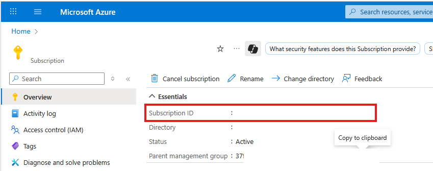
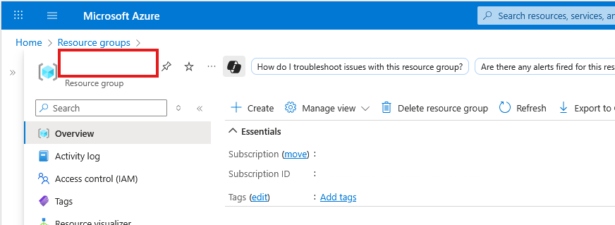
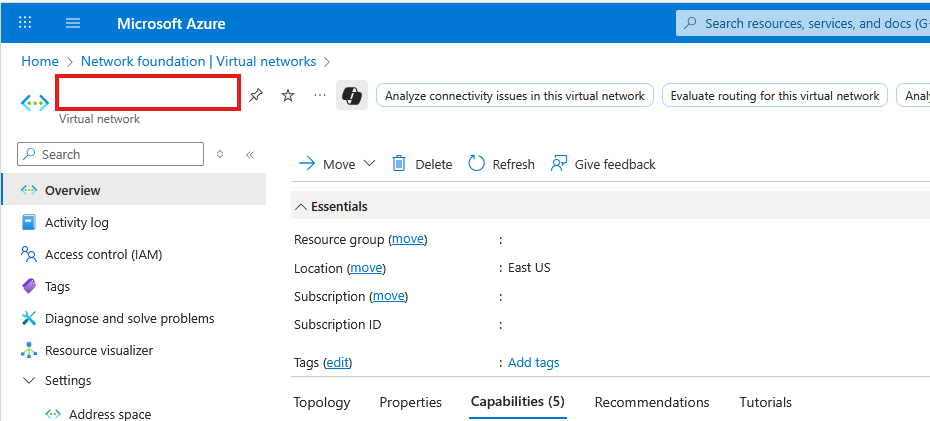
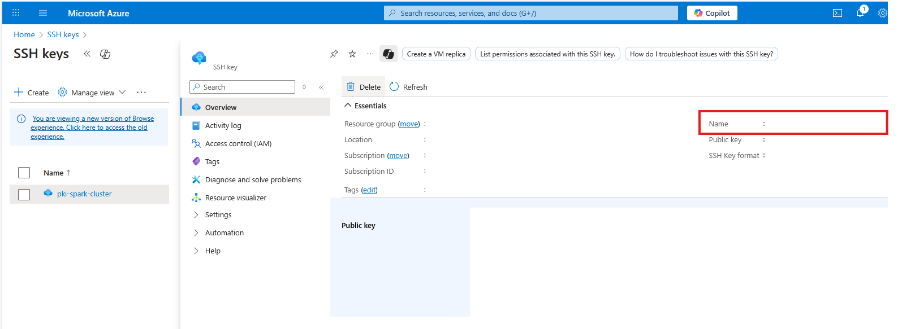

# Requisitos

Esta automatización requiere de configuraciones previas en Azure, Cloudflare y Azure DevOps. Aunque solo la primera es necesaria para el funcionamiento. A continuación vamos a describir los pasos necesarios.

## Azure

1. _Suscripción activa:_ Antes de proceder con la generación de recursos, necesitamos una suscripción activa en Azure. De esta obtenemos el identificador que lo usaremos en la variable `ID_SUSRCIPCION`

**Recuerda que los costos asociados al uso de esta herramienta estarán vinculados a la suscripción que ingreses**
**Adicionalmente, no es necesario crear estos objetos si ya los dispones.**

2. _Grupo de recursos:_ Una vez dispongamos de una suscripción activa requerimos un grupo de recursos en la suscripción anterior. El nombre de este grupo lo vamos a colocar en la variable `GRUPO_RECURSOS`

3. _Red virtual:_ Con el grupo de recursos creado, vamos a definir la red virtual a la que se conectará el cluster. El nombre de la red virtual lo debes colocar en la variable: `NOMBRE_RED_VIRTUAL`

4. _SubRed Virtual:_ Con la red seleccionada, debemos especificar la subred a la que se van a conectar los nodos. El nombre de la subred se debe colocar en la variable: `NOMBRE_SUBRED`

5. _Clave SSH:_ Ahora, para el acceso a las máquinas virtuales, el script utiliza una única clave pública para el uso del protocolo ssh. Para esto se debe crear una clave pública ssh en Azure y utilizar el nombre en la variable `NOMBRE_CLAVE_SSH`. El archivo `.pem` debe encontrarse en el directorio del script para que se pueda usar en las configuraciones

6. _Tamaño de instancia:_ Puedes encontrar los diferentes tamaños de instancias que dispone Azure en el siguiente enlace: https://learn.microsoft.com/en-us/azure/virtual-machines/sizes/overview?tabs=breakdownseries%2Cgeneralsizelist%2Ccomputesizelist%2Cmemorysizelist%2Cstoragesizelist%2Cgpusizelist%2Cfpgasizelist%2Chpcsizelist Además, recuerda verificar que la suscripción tiene la cuota necesaria para la familia que quieres implementar de acuerdo a la región.

7. _Grupo Recursos Vnet:_ Puede suceder que tengas tu vnet en un grupo de recursos diferente al grupo que definiste para el clúster. En este caso puedes utilizar la variable `GRUPO_RECURSOS_VNET`. En el caso de que sea la misma, no olvides colocar como parámetro el grupo de recursos de igual manera.

8. _IP_PUBLICA:_ Por seguridad, las reglas de cortafuegos solo habilitan en acceso a una sola IP que es definida en la variable `IP_PUBLICA`. Aquí debes colocar tu IP Pública para que las reglas funcionen correctamente

9. _RUTA_SCRIPTS_DEPENDENCIAS:_ Aquí debes especificar la ruta completa a la carpeta de los scripts del instalación de dependencia. Por ejemplo, si clonaste el repositorio en: `E:\Usuarios\Descargas\Auto-Az-Spark\` entonces la ruta a colocar sería: `E:/Usuarios/Descargas/Auto-Az-Spark/scripts`

## Cloudflare

En construcción...

## DevOps

En construcción...
